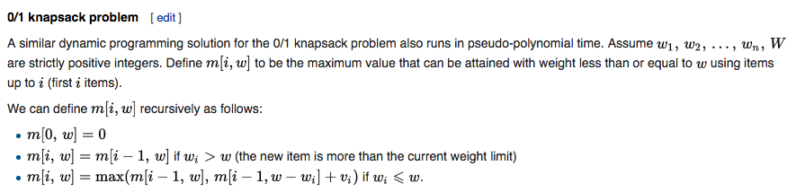

## Greedy Algorithm
### Fence Repair

Extended reading - huffman code

* Huffman code is not unique:
1. at various stages we had to make choices, like which of the two are going to combine first, when 3 or more of them have the same possibilities.
2. assignment rule of 0 & 1 is changable.

* Huffman code is uniquely decoable:
1. prefix code - no prefix part of a code is a code by itself.

## Dynamic Programming Algorithm
### 0/1 knapsack-alg
Key rule - to choose and not to choose.

We can define m[i,w] m[i,w] recursively as follows:

